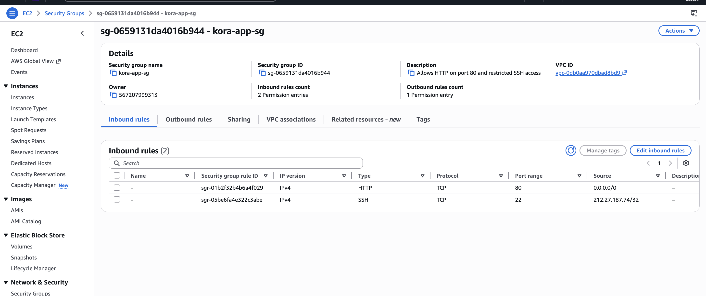
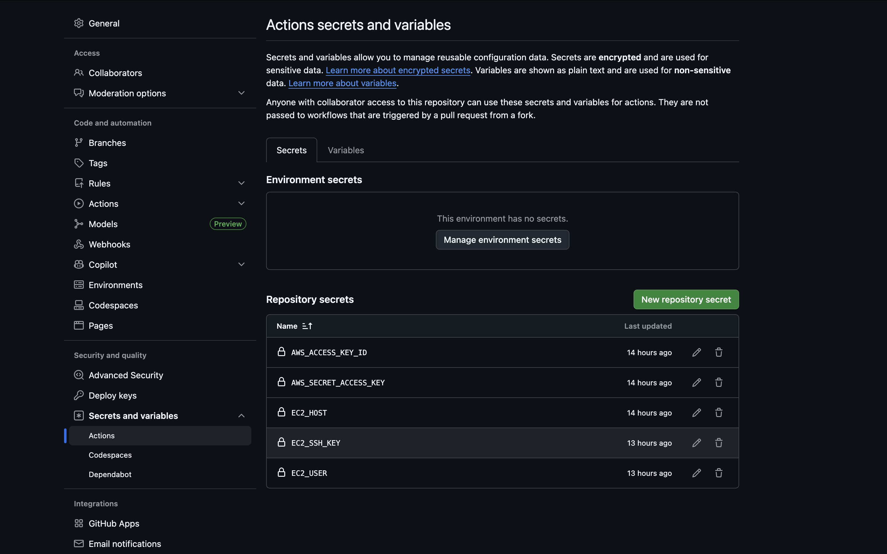
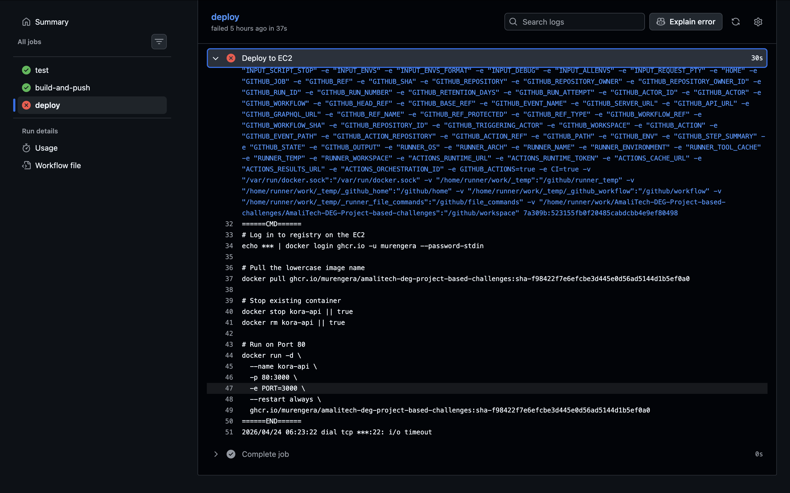
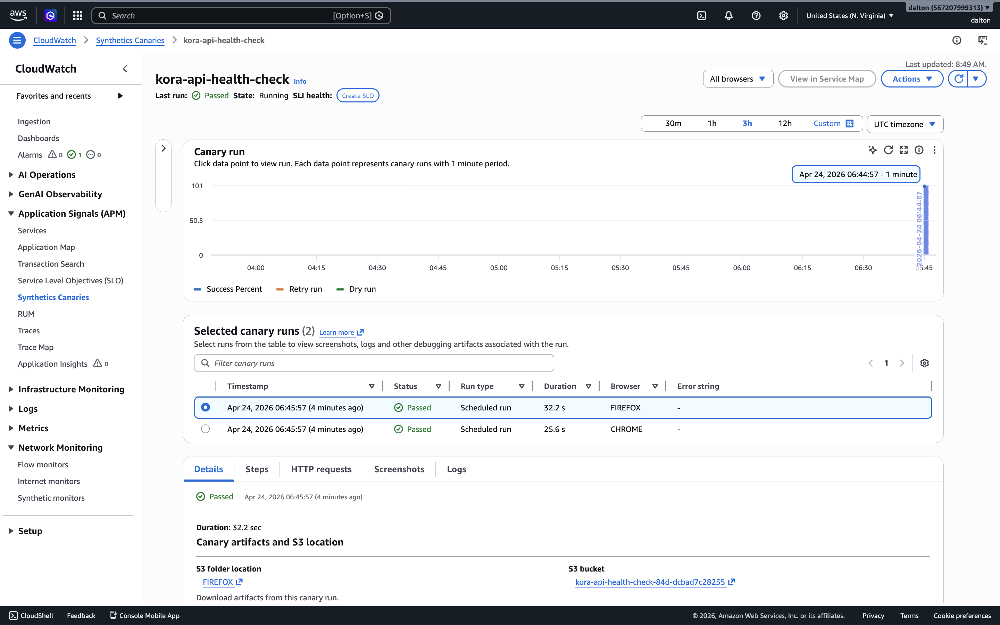
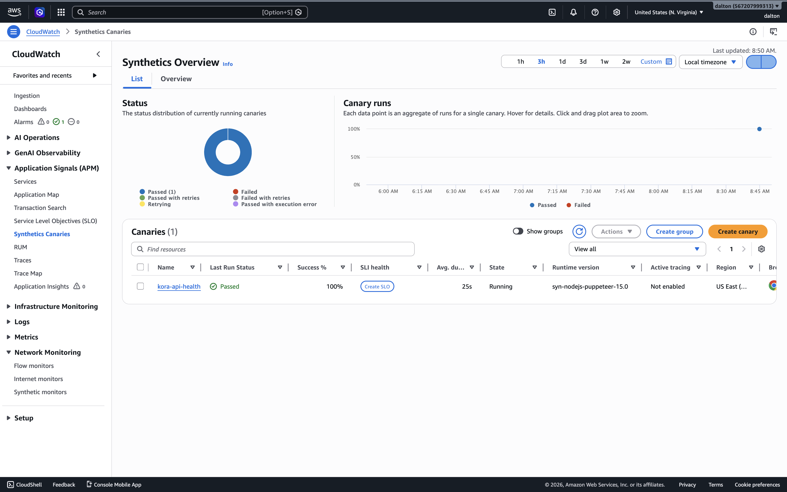

# **Deployment & Infrastructure Documentation**

This document details the end-to-end deployment lifecycle for the Kora Analytics API, covering infrastructure provisioning, automated CI/CD pipelines, security hardening, and proactive monitoring.

---

## **1. Cloud Infrastructure (AWS EC2)**
The application is hosted on a dedicated AWS EC2 instance. The infrastructure was provisioned to balance accessibility with the principle of "Least Privilege."

### **Instance Specifications**
* **Name:** `kora-app-server`
* **Instance ID:** `i-04f8e1d15ec6eeef7`
* **AMI:** Amazon Linux 2023
* **Instance Type:** `t2.micro` (Free Tier)
* **Public IP:** `3.84.144.23`

### **Network Security (Firewall)**
The Security Group `kora-app-sg` was configured to secure the administrative layer:
* **HTTP (Port 80):** Open to `0.0.0.0/0` to serve the API globally.
* **SSH (Port 22):** Strictly restricted to **Administrative IP only** (`212.27.187.74/32`). This prevents unauthorized remote access and brute-force attempts.



---

## **2. Automated CI/CD & Secret Management**

### **GitHub Actions Secrets**
To maintain high security, no sensitive credentials (SSH keys, AWS tokens, or IPs) are stored in the source code. These are managed via **GitHub Repository Secrets**.



### **The Pipeline Flow**
1.  **Continuous Integration:** On every push, GitHub Actions builds the Docker image and runs tests.
2.  **Container Registry:** The built image is pushed to **GitHub Container Registry (GHCR)** using a lowercase naming convention for compatibility.
3.  **Deployment:** The runner SSHs into the EC2 instance, pulls the new image, and restarts the container.

### **Note on Security vs. Automation**
By restricting SSH (Port 22) to a specific IP, the automated deployment pipeline will show a **failed status** (`i/o timeout`) on subsequent pushes. This is **intentional behavior** confirming that the AWS firewall is successfully blocking unauthorized IPs (the GitHub runners) from accessing the server's terminal.



---

## **3. Docker Operations**

### **Docker Installation (Amazon Linux 2023)**
To set up the environment, I installed and configured Docker using the following commands:

```bash
# Update system packages
sudo dnf update -y

# Install Docker
sudo dnf install -y docker

# Start and enable Docker service
sudo systemctl start docker
sudo systemctl enable docker

# Add ec2-user to docker group (Log out and back in for changes to take effect)
sudo usermod -aG docker ec2-user
```

### **Docker Environment Verification**
The host is configured with Docker 25.x. Permissions are managed to allow the `ec2-user` to manage containers without root access.

```bash
# Verify Docker service status
sudo systemctl status docker

# Check running containers
docker ps
```

### **Manual Image Management**
While the pipeline automates this, manual pulls can be performed as follows:
```bash
docker pull ghcr.io/murengera/amalitech-deg-project-based-challenges:latest
docker run -d --name kora-api -p 80:3000 --restart always <image_name>
```

### **Operational Commands (Monitoring & Logs)**
Once the container is running, use these commands to monitor health and performance:

#### **Check if Docker Container is Running**
```bash
# List all running containers
docker ps

# List all containers (including stopped ones)
docker ps -a
```

#### **Monitor Application Logs**
```bash
# Follow logs in real-time
docker logs -f kora-api

# View the last 100 lines of logs
docker logs --tail 100 kora-api
```

#### **Check Container Health Status**
Since the container has a built-in healthcheck, you can inspect its status:
```bash
# View detailed health status (JSON)
docker inspect --format='{{json .State.Health}}' kora-api

# Quick check of the container state and health
docker ps --format "table {{.Names}}\t{{.Status}}\t{{.Ports}}"
```

#### **Resource Usage & Processes**
```bash
# View live resource usage (CPU, Memory, I/O)
docker stats kora-api

# List processes running inside the container
docker top kora-api
```

---

## **4. Monitoring & Alerting (Bonus)**
A proactive monitoring layer was added to ensure the API is not only "running" but "responding correctly."

### **CloudWatch Synthetics (Canary)**
A "Heartbeat" Canary visits `http://3.84.144.23/health` every 5 minutes. It expects a `200 OK` status and a valid JSON response.



### **Automated Alarms**
I configured a **CloudWatch Alarm** (`kora-api-down-alarm`) that triggers if the Canary's `SuccessPercent` falls below **100%**. This ensures that if the Docker container crashes or the server hangs, an alert is generated immediately.



---

## **5. Verification**
The application health can be verified publicly at:
[http://3.84.144.23/health](http://3.84.144.23/health)
