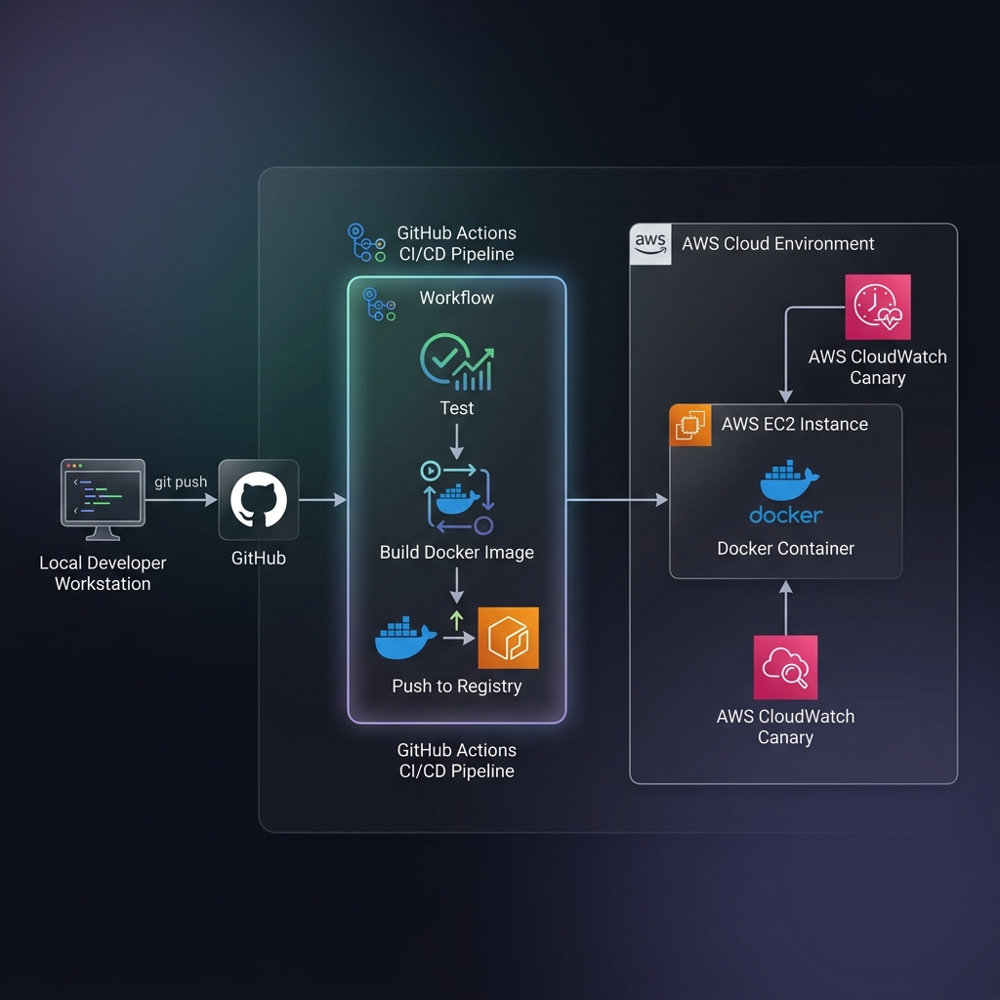
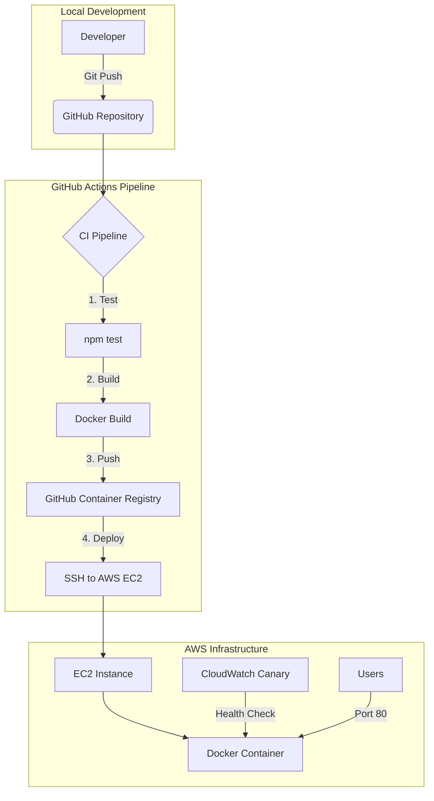

# **Kora Analytics API — DevOps Implementation**

This repository contains the end-to-end DevOps transformation for the Kora Analytics Node.js API. The project bridges the gap between manual deployments and a modern, automated, and monitored infrastructure-as-code approach.

---

## **1. Architecture Overview**

The system is designed for high reliability and security, utilizing a container-first strategy and automated delivery.

### **Visual Architecture Diagram**


> **[🔗 View Professional Architecture Diagram (Google Drive)](https://drive.google.com/file/d/1IB5XE4iTm7CiY0ka2sa_Bw2UDklgSl62/view?usp=sharing)**
> **[🔗 GitHub Repository Source](https://github.com/murengera/AmaliTech-DEG-Project-based-challenges/blob/main/dev-ops/DeployReady/screenshots/architecture-diagram.png)**

### **System Workflow**


### **Core Components**
*   **Application**: A lightweight Node.js API serving logistics metadata.
*   **Containerization**: Docker-based environment for environmental parity.
*   **Orchestration**: Docker Compose for local multi-service simulation.
*   **CI/CD**: GitHub Actions for seamless automated deployment.
*   **Monitoring**: AWS CloudWatch Synthetics for proactive health tracking.

---

## **2. What Was Accomplished**

Below is a summary of every task completed for this project.

### **Part 1 — Containerization**
| Task | Details |
| :--- | :--- |
| **Dockerfile** | Multi-stage build using `node:18-alpine`. Stage 1 installs production deps only (`npm ci --only=production`). Stage 2 copies artifacts into a clean image. |
| **Non-root user** | Created `appuser:appgroup` inside the container. Application runs as this user — never as root (principle of least privilege). |
| **Environment variable** | `PORT` is configurable via environment variable with a default of `3000`. |
| **Docker Compose** | Maps host port `3000` → container port `${PORT}`. Loads configuration from `.env` file. Includes `restart: unless-stopped` and a built-in healthcheck on `/health`. |
| **`.dockerignore`** | Prevents `.git/`, `screenshots/`, `*.md`, `.env`, and `*.pem` from being copied into the Docker image — reducing image size and eliminating secret leakage risk. |

### **Part 2 — CI/CD Pipeline (GitHub Actions)**
| Task | Details |
| :--- | :--- |
| **Test stage** | Runs `npm ci` + `npm test` (Jest + Supertest) on every push. Broken code never reaches the registry. |
| **Build & Push stage** | Builds the Docker image and pushes it to **GitHub Container Registry (GHCR)** with both `latest` and `sha-<commit>` tags for immutable versioning. |
| **Deploy stage** | SSHs into the AWS EC2 instance via `appleboy/ssh-action`, pulls the new image, stops the old container, and starts the new one on port 80. |
| **Path filtering** | Pipeline only triggers on changes to `dev-ops/DeployReady/**` or `.github/workflows/deploy.yml` — avoids wasted runs on unrelated commits. |
| **Timeout guards** | Every job has `timeout-minutes: 10` to prevent hung runners from consuming resources. |
| **Secret injection** | `GITHUB_TOKEN` is passed via the `envs` parameter (not interpolated in the script string) to prevent accidental leakage in logs. |

> **Note**: The workflow file is located at `.github/workflows/deploy.yml` — this is mandatory for GitHub Actions to detect it. It cannot be placed inside `dev-ops/`.

### **Part 3 — Cloud Deployment (AWS EC2)**
| Task | Details |
| :--- | :--- |
| **EC2 Instance** | `t2.micro` (Free Tier) running Amazon Linux 2023 with Docker 25.x installed. |
| **Security Group** | HTTP (port 80) open to `0.0.0.0/0` for public API access. SSH (port 22) restricted to admin IP `212.27.187.74/32` only. |
| **Container runtime** | Application runs via `docker run -d --name kora-api -p 80:3000 --restart always`. Auto-restarts on crash. |
| **Secrets management** | All credentials (SSH key, EC2 host, EC2 user) stored in **GitHub Repository Secrets** — zero hardcoded values in code. |

### **Part 4 — Monitoring & Alerting (Bonus)**
| Task | Details |
| :--- | :--- |
| **CloudWatch Synthetics Canary** | A "Heartbeat" canary hits `http://3.84.144.23/health` every 5 minutes and expects a `200 OK` response. |
| **CloudWatch Alarm** | `kora-api-down-alarm` triggers if the canary's `SuccessPercent` drops below 100%, enabling rapid incident response. |

### **Part 5 — Security & Hygiene Hardening**
| Task | Details |
| :--- | :--- |
| **`.gitignore` (root)** | Repository-wide exclusion of `.DS_Store`, `node_modules/`, `.env`, `*.pem`, `*.key`, and Terraform state files. |
| **`.gitignore` (project)** | Project-level exclusion layer with the same protections. |
| **No secrets in repo** | Verified: zero `.pem`, `.key`, `.env`, or hardcoded credentials committed. |
| **`.env.example`** | Committed with placeholder values (`PORT=3000`) so collaborators know which env vars are required. |

---

## **3. Pre-Submission Checklist**

| # | Requirement | Status | Proof |
| :---: | :--- | :---: | :--- |
| 1 | `docker compose up --build` starts the app locally | ✅ | See [docker-compose.yml](./docker-compose.yml) and [Dockerfile](./Dockerfile) |
| 2 | `.env.example` is committed (real `.env` is not) | ✅ | [.env.example](./.env.example) committed · `.env` in [.gitignore](./.gitignore) |
| 3 | At least one successful pipeline run in GitHub Actions | ✅ | See [GitHub Actions tab](https://github.com/murengera/AmaliTech-DEG-Project-based-challenges/actions) and [screenshot](./screenshots/pipeline-success-open-port.png) |
| 4 | `GET /health` returns 200 on deployed server | ✅ | [http://3.84.144.23/health](http://3.84.144.23/health) — returns `{"status":"ok"}` |
| 5 | No secrets or `.pem` files committed | ✅ | `.gitignore` excludes `*.pem`, `*.key`, `.env` · [screenshot](./screenshots/github-secrets.png) |
| 6 | SSH (port 22) not open to `0.0.0.0/0` | ✅ | Restricted to `212.27.187.74/32` — [screenshot](./screenshots/security-group-rules.png) |
| 7 | `DEPLOYMENT.md` covers setup, deployment, env vars, troubleshooting | ✅ | [DEPLOYMENT.md](./DEPLOYMENT.md) |
| 8 | Default README replaced with project documentation | ✅ | You're reading it |
| 9 | Commit history shows incremental progress | ✅ | 18+ commits from initial setup → containerization → CI/CD → security hardening → docs |

---

## **4. Setup & Installation**

### **Local Development**
To run the API locally using Docker, ensure you have Docker and Docker Compose installed.

1.  **Clone the Repository:**
    ```bash
    git clone https://github.com/murengera/AmaliTech-DEG-Project-based-challenges.git
    cd AmaliTech-DEG-Project-based-challenges/dev-ops/DeployReady
    ```

2.  **Configure Environment:**
    ```bash
    cp .env.example .env
    # Edit .env and set your desired PORT (e.g., 3000)
    ```

3.  **Start the Application:**
    ```bash
    docker compose up --build
    ```
    The API will be available at `http://localhost:3000`.

4.  **Verify Health:**
    ```bash
    curl http://localhost:3000/health
    # Expected: {"status":"ok"}
    ```

### **Cloud Deployment**
The application is automatically deployed to AWS on every push to the `main` branch. For manual verification or logging instructions, see [DEPLOYMENT.md](./DEPLOYMENT.md).

---

## **5. Key Decisions & Rationale**

### **Security First**
*   **Non-Root User**: The `Dockerfile` implements an `appuser` to run the application, adhering to the principle of least privilege within the container.
*   **SSH Hardening**: Port 22 is strictly restricted to the administrative IP address, effectively nullifying brute-force attack vectors on the host level.
*   **Secret Management**: Zero hardcoded credentials. All deployment keys and registry tokens are managed via encrypted GitHub Secrets.

### **Automated Reliability**
*   **CI-Before-CD**: A mandatory testing phase runs before any build. This ensures that broken code never reaches the registry and minimizes downtime.
*   **Immutable Tags**: Images are pushed to GHCR with the commit SHA as a tag, enabling precise rollbacks and audit trails.
*   **Healthcheck**: Docker Compose monitors the `/health` endpoint every 30 seconds, auto-restarting the container if it becomes unresponsive.

### **Proactive Monitoring (Bonus Implementation)**
Instead of waiting for a crash report, I implemented an **AWS CloudWatch Synthetics Canary**.
*   **Heartbeat Monitoring**: The canary visits the `/health` endpoint every 5 minutes.
*   **Automated Alarms**: A CloudWatch Alarm triggers immediately if the success rate falls below 100%, allowing for rapid response before users are affected.

---

## **6. API Documentation**

The API provides the following endpoints:

| Endpoint | Method | Description |
| :--- | :--- | :--- |
| `/health` | `GET` | Returns 200 OK and system status. |
| `/metrics` | `GET` | Returns real-time uptime and memory usage. |
| `/data` | `POST` | Accepts and echoes back JSON payloads for integration testing. |

---

## **7. Evidence & Screenshots**

All evidence screenshots are stored in the [`screenshots/`](./screenshots/) directory:

| Screenshot | What It Proves |
| :--- | :--- |
| [EC2 Dashboard](./screenshots/ec2-dashboard.png) | Instance is running on AWS |
| [Security Group Rules](./screenshots/security-group-rules.png) | SSH restricted to admin IP only |
| [GitHub Secrets](./screenshots/github-secrets.png) | Credentials stored securely, not in code |
| [Pipeline Success](./screenshots/pipeline-success-open-port.png) | CI/CD pipeline executes successfully |
| [Pipeline Blocked by Security](./screenshots/pipeline-blocked-by-security.png) | SSH firewall blocks unauthorized deploy attempts |
| [Security Timeout Proof](./screenshots/security-proof-timeout.png) | Intentional timeout confirms firewall is active |
| [CloudWatch Canary Graph](./screenshots/canary-graph.png) | Health endpoint monitored every 5 minutes |
| [CloudWatch Alarm OK](./screenshots/alarm-ok.png) | Alarm is configured and currently passing |
| [Architecture Diagram](./screenshots/architecture-diagram.png) | [Full System Design (Google Drive)](https://drive.google.com/file/d/1IB5XE4iTm7CiY0ka2sa_Bw2UDklgSl62/view?usp=sharing) |

---

## **8. Project Structure**

```text
.
├── .github/workflows/
│   └── deploy.yml              # CI/CD pipeline (GitHub Actions requires this location)
├── dev-ops/DeployReady/
│   ├── app/                    # Node.js source code & tests
│   │   ├── index.js            # Express API (health, metrics, data endpoints)
│   │   ├── index.test.js       # Jest + Supertest test suite (4 tests)
│   │   ├── package.json        # App dependencies
│   │   └── package-lock.json   # Locked dependency versions
│   ├── screenshots/            # Evidence of pipeline, security & monitoring
│   ├── .dockerignore           # Excludes docs/secrets from Docker build
│   ├── .env.example            # Template for environment variables
│   ├── .gitignore              # Project-level git exclusions
│   ├── DEPLOYMENT.md           # Infrastructure & deployment documentation
│   ├── Dockerfile              # Multi-stage production container
│   ├── docker-compose.yml      # Local development with healthcheck
│   └── README.md               # This file
└── .gitignore                  # Root-level repo hygiene
```
