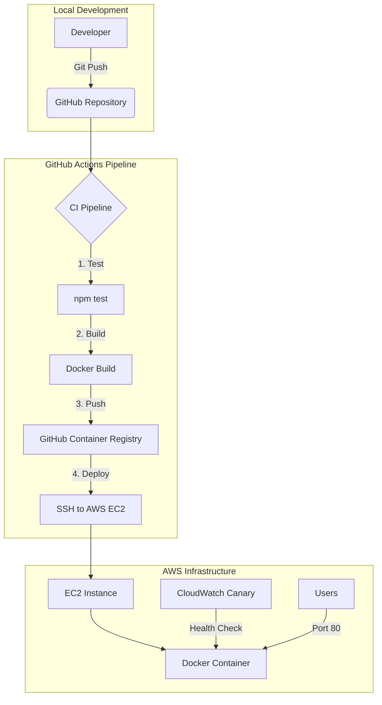

# **Kora Analytics API — DevOps Implementation**

<!-- 


 -->

This repository contains the end-to-end DevOps transformation for the Kora Analytics Node.js API. The project bridges the gap between manual deployments and a modern, automated, and monitored infrastructure-as-code approach.

---

## **1. Architecture Overview**

The system is designed for high reliability and security, utilizing a container-first strategy and automated delivery.



### **Core Components**
*   **Application**: A lightweight Node.js API serving logistics metadata.
*   **Containerization**: Docker-based environment for environmental parity.
*   **Orchestration**: Docker Compose for local multi-service simulation.
*   **CI/CD**: GitHub Actions for seamless automated deployment.
*   **Monitoring**: AWS CloudWatch Synthetics for proactive health tracking.

---

## **2. Setup & Installation**

### **Local Development**
To run the API locally using Docker, ensure you have Docker and Docker Compose installed.

1.  **Clone the Repository:**
    ```bash
    git clone https://github.com/murengera/AmaliTech-DEG-Project-based-challenges.git
    cd AmaliTech-DEG-Project-based-challenges/dev-ops/DeployReady
    ```

2.  **Configure Environment:**
    ```bash
    cp .env.example .env
    # Edit .env and set your desired PORT (e.g., 3000)
    ```

3.  **Start the Application:**
    ```bash
    docker compose up --build
    ```
    The API will be available at `http://localhost:3000`.

### **Cloud Deployment**
The application is automatically deployed to AWS on every push to the `main` branch. For manual verification or logging instructions, see [DEPLOYMENT.md](./DEPLOYMENT.md).

---

## **3. Key Decisions & Rationale**

### **Security First**
*   **Non-Root User**: The `Dockerfile` implements a `node` user to run the application, adhering to the principle of least privilege within the container.
*   **SSH Hardening**: Port 22 is strictly restricted to the administrative IP address, effectively nullifying brute-force attack vectors on the host level.
*   **Secret Management**: Zero hardcoded credentials. All deployment keys and registry tokens are managed via encrypted GitHub Secrets.

### **Automated Reliability**
*   **CI-Before-CD**: A mandatory testing phase runs before any build. This ensures that broken code never reaches the registry and minimizes downtime.
*   **Immutable Tags**: Images are pushed to GHCR with the commit SHA as a tag, enabling precise rollbacks and audit trails.

### **Proactive Monitoring (Bonus Implementation)**
Instead of waiting for a crash report, I implemented an **AWS CloudWatch Synthetics Canary**. 
*   **Heartbeat Monitoring**: The canary visits the `/health` endpoint every 5 minutes.
*   **Automated Alarms**: A CloudWatch Alarm triggers immediately if the success rate falls below 100%, allowing for rapid response before users are affected.

---

## **4. API Documentation**

The API provides the following endpoints:

| Endpoint | Method | Description |
| :--- | :--- | :--- |
| `/health` | `GET` | Returns 200 OK and system status. |
| `/metrics` | `GET` | Returns real-time uptime and memory usage. |
| `/data` | `POST` | Accepts and echoes back JSON payloads for integration testing. |

---

## **5. Project Structure**
```text
.
├── .github/workflows/deploy.yml  # CI/CD Pipeline Definition
├── app/                          # Node.js Source Code
├── dev-ops/DeployReady/
│   ├── DEPLOYMENT.md             # Technical infrastructure notes
│   ├── Dockerfile                # Production container config
│   ├── docker-compose.yml        # Local development config
│   └── screenshots/              # Evidence of monitoring & security
└── README.md                     # Project documentation
```
